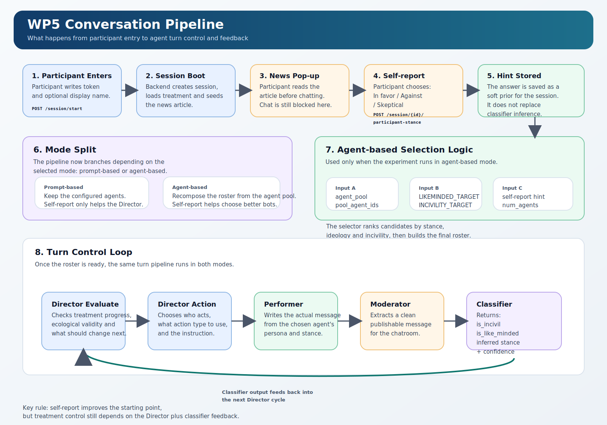

# Conversation Pipeline

Este documento explica el pipeline actual de la plataforma de forma operativa:

- que ve el participante al entrar
- cuando se recoge su postura inicial
- como se eligen los bots en `agent-based`
- que hace el Director en cada turno
- como vuelve la clasificacion al sistema

Diagrama:

## 1. Resumen en 30 segundos

El flujo real es este:

1. El participante entra con token.
2. El backend crea la sesion y siembra la noticia del tratamiento.
3. El frontend abre un pop-up con la noticia.
4. El participante marca `In favor`, `Against` o `Skeptical`.
5. Esa respuesta se guarda como `self-report`.
6. En `agent-based`, ese `self-report` ayuda a seleccionar mejor el roster inicial de bots.
7. Empieza el loop de turnos:
   - Director Evaluate
   - Director Action
   - Performer
   - Moderator
   - Classifier
8. El resultado del Classifier vuelve al Director en el siguiente turno.

La idea clave es esta:

- el `self-report` mejora el punto de partida
- el Director sigue intentando cumplir el `internal_validity_criteria`
- el Classifier sigue midiendo lo que de verdad ha salido

## 2. Inicio de la sesion

### Paso 1. Login

El participante entra con:

- token
- nombre opcional

El frontend llama a `POST /session/start`.

El backend:

- valida el token
- asigna el `treatment_group`
- crea una sesion pendiente

### Paso 2. Conexion al chat

Cuando el frontend abre el WebSocket:

- se crea la sesion viva
- se cargan las features del tratamiento
- se siembra la noticia si el experimento usa `news_article`

### Paso 3. Pop-up de noticia

La noticia aparece en un modal antes de empezar a chatear.

Ese modal hace dos cosas:

- obliga a leer el contexto inicial
- recoge la postura inicial del participante

Las opciones son:

- `In favor`
- `Against`
- `Skeptical`

Mientras no se responde, el pipeline no deja arrancar la conversacion normal.

## 3. Que significa el self-report

La respuesta del participante es una pista inicial. No es la verdad final del sistema.

Sirve para:

- arrancar mejor la seleccion de agentes en `agent-based`
- darle al Director una senal temprana

No sirve para:

- reemplazar al Classifier
- fijar para siempre la postura del participante
- ignorar lo que el participante escriba despues

Por eso la regla correcta es:

`self-report = soft prior`

## 4. Diferencia entre prompt-based y agent-based

### Prompt-based

En `prompt-based`:

- el roster de agentes es el configurado en la sesion
- el Director intenta empujar su comportamiento con prompts
- el `self-report` solo entra como contexto adicional

Uso practico:

- mas flexible
- menos consistente si quieres controlar muy bien ideology / like-mindedness / incivility

### Agent-based

En `agent-based`:

- existe un `agent_pool` con agentes mas definidos
- cada agente tiene rasgos fijos:
  - `stance`
  - `incivility`
  - `ideology`
  - `persona`
- cada tratamiento puede limitar los candidatos con `pool_agent_ids`
- el sistema recompone el roster de la sesion usando targets del tratamiento y el `self-report`

Uso practico:

- mas consistente
- mejor para treatments donde quieres que el elenco arranque ya sesgado en una direccion concreta

## 5. Como se eligen los bots en agent-based

La seleccion se hace en backend antes de que empiecen los turnos normales.

### Inputs reales

El selector usa:

- `agent_pool`
- `pool_agent_ids` del treatment
- `num_agents`
- `LIKEMINDED_TARGET`
- `INCIVILITY_TARGET`
- `participant_stance_hint`

### Logica

El selector hace esto:

1. Coge el `agent_pool` completo del experimento.
2. Si el tratamiento define `pool_agent_ids`, filtra los agentes permitidos.
3. Lee el `LIKEMINDED_TARGET` y el `INCIVILITY_TARGET`.
4. Traduce el `self-report` del participante a una preferencia inicial:
   - `In favor` -> prioriza agentes `agree`
   - `Against` -> prioriza agentes `disagree`
   - `Skeptical` -> prioriza agentes `neutral`
5. Dentro de esos candidatos, ordena tambien por `ideology` e `incivility`.
6. Construye el roster final intentando acercarse a los targets del treatment.
7. Si faltan candidatos perfectos, completa con el mejor fallback posible.

### Ejemplo concreto

Supongamos:

- noticia climatica
- participante marca `Against`
- treatment con mucho `like-minded`
- tratamiento con incivility media

El selector intentara meter mas bots:

- con `stance = disagree`
- con un nivel de `incivility` compatible con el target

Si el treatment fuera `not-like-minded`, intentaria meter mas bots del lado contrario.

## 6. Que hace el Director

El Director no escribe mensajes directamente. Orquesta la conversacion.

En cada ciclo ve:

- el historial reciente
- el `internal_validity_criteria`
- la evaluacion previa
- la distribucion de acciones
- los perfiles acumulados de los agentes
- el `self-report` del participante
- y en `agent-based`, los rasgos fijos del roster

Su trabajo es:

- decidir quien habla
- decidir que tipo de accion conviene
- empujar la conversacion hacia el tratamiento objetivo

## 7. Pipeline por turno

Una vez la sesion esta activa, cada turno sigue esta secuencia.

### A. Director Evaluate

Evalua:

- como va el `internal_validity_criteria`
- como va la validez ecologica
- que hay que corregir o mantener

### B. Director Action

Decide:

- que agente actua
- si hace `message`, `reply`, `@mention` o `like`
- con que objetivo

### C. Performer

El agente elegido redacta el contenido desde su persona y su posicion.

### D. Moderator

El Moderator limpia la salida del Performer y extrae un mensaje publicable para la sala.

### E. Classifier

Despues de publicar, el Classifier etiqueta el mensaje con:

- `is_incivil`
- `is_like_minded`
- `inferred_participant_stance`
- `stance_confidence`

### F. Feedback loop

Esas etiquetas:

- se guardan
- se incluyen en las metricas de fidelidad
- vuelven al Director en el siguiente ciclo

Por eso esto no es una cadena simple de generacion. Es un loop de control.

## 8. Quien manda realmente en el tratamiento

La respuesta corta es:

- el roster inicial ayuda
- el Director manda el turno a turno
- el Classifier arbitra lo que realmente ha pasado

En `agent-based`, el roster hace el sistema mas robusto porque el Director trabaja sobre agentes con rasgos mas estables.

Pero el tratamiento no se cumple solo con el roster. Se cumple porque:

1. el Director intenta llevar la conversacion en esa direccion
2. el Classifier mide si lo esta consiguiendo
3. el siguiente turno se ajusta con ese feedback

## 9. Regla final para entender el sistema

La forma mas clara de pensarlo es esta:

- `prompt-based`
  - mismos agentes
  - mas control por prompt

- `agent-based`
  - mejores agentes de salida
  - el Director sigue controlando

- `classifier`
  - mide el resultado real
  - devuelve feedback al Director

En una linea:

`token -> noticia -> self-report -> seleccion de roster -> Director -> Performer -> Moderator -> Classifier -> Director`
